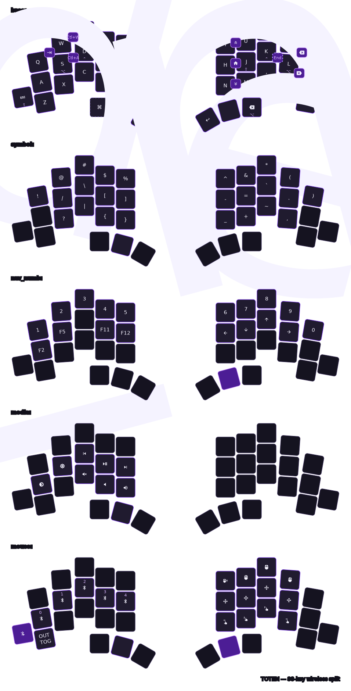

# ZMK Totem Firmware

Personal [ZMK](https://zmk.dev) firmware configuration for the [TOTEM](https://github.com/GEIGEIGEIST/TOTEM) — a 38-key wireless split keyboard powered by two [Seeed XIAO BLE](https://wiki.seeedstudio.com/XIAO_BLE/) controllers.

Firmware is built automatically by GitHub Actions on every push and the resulting `.uf2` files are available as workflow artifacts.

---

## Keymap

The keymap uses 5 layers. The **Mouse** layer is activated conditionally when **Symbol** and **Nav/Num** are held simultaneously.

> [!NOTE]
> The SVG below is auto-generated by [keymap-drawer](https://github.com/caksoylar/keymap-drawer) on every push.



---

## Layers

| # | Name | Activation |
|---|------|------------|
| 0 | **Base** | Default |
| 1 | **Symbol** | Hold `Symbol` thumb key |
| 2 | **Nav / Num** | Hold `Nav` thumb key |
| 3 | **Media** | Tap-dance on `Symbol` key (double tap) |
| 4 | **Mouse** | Hold Symbol **+** Nav simultaneously |

### Key features

- **Home-row mods (HRM)** — `A S D F` and `J K L ;` act as `Alt / Ctrl / Shift / GUI` when held
- **Combos** — `Tab`, `Ctrl+A`, `Ctrl+W`, `Backspace`, `Delete`, `Home`, `End`, `PgUp`, `PgDn`
- **Pointing** — mouse movement, scrolling and clicks on the Mouse layer (`CONFIG_ZMK_POINTING`)
- **Bluetooth** — up to 5 profiles, selectable from the Mouse layer; `BT_CLR` clears the active profile

---

## Flashing

Firmware `.uf2` files are produced by the [Build ZMK firmware](.github/workflows/build.yml) GitHub Actions workflow.

### 1. Download the firmware

1. Go to the **Actions** tab of this repository
2. Open the latest successful **Build ZMK firmware** run
3. Download the `firmware` artifact — it contains:
   - `xiao_ble-totem_left.uf2`
   - `xiao_ble-totem_right.uf2`

### 2. Flash each half

Repeat for **left** and **right** halves:

1. Connect the XIAO BLE to your computer via USB-C
2. **Double-tap** the reset button to enter bootloader mode — a drive named `XIAO-SENSE` (or `XIAO BLE`) will appear
3. Drag and drop the corresponding `.uf2` file onto the drive
4. The controller will reboot automatically once flashing is complete

> [!TIP]
> Flash the **right** half first, then the **left**. After both halves are flashed, they pair over Bluetooth automatically.

> [!WARNING]
> If the keyboard was previously paired to a device and you are having connection issues, use the **Mouse** layer to clear the Bluetooth profile (`BT_CLR`) before re-pairing.

---

## Local development

This repo uses the standard [ZMK user config](https://zmk.dev/docs/user-setup) structure.
The `config/west.yml` manifest pulls ZMK from its upstream `main` branch.

```
zmk_totem_firmware/
├── .github/
│   └── workflows/
│       ├── build.yml            # ZMK firmware build
│       └── draw-keymaps.yml     # keymap-drawer SVG generation
├── config/
│   ├── boards/shields/          # TOTEM shield definitions
│   ├── totem.keymap             # Keymap (all layers)
│   ├── totem.conf               # Kconfig options
│   └── west.yml                 # West manifest
├── keymap-drawer/
│   └── totem.svg                # Auto-generated keymap drawing
└── keymap_drawer.config.yaml    # keymap-drawer theme & glyph config
```
